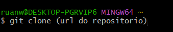
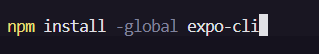
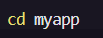
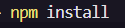

# Instruções para Usar o Código com Expo
Este guia fornece as instruções necessárias para configurar e executar o aplicativo React Native utilizando o Expo.

## Pré-requisitos
Antes de começar, certifique-se de que você tenha os seguintes requisitos instalados:

--> Node.js: Versão 14 ou superior.
npm ou yarn: Gerenciador de pacotes para instalar dependências.

--> Expo CLI: Ferramenta para criar e gerenciar projetos Expo.

## Passo 1: Clonar o Repositório
Clone o repositório do projeto para o seu ambiente local:

## Passo 2: Instalar Expo CLI
Se você ainda não tiver o Expo CLI instalado globalmente, instale-o usando o npm ou yarn:

## Passo 3: Instalar Dependências
Navegue até o diretório do projeto clonado:

Instale as dependências do projeto:

## Passo 4: Iniciar o Servidor de Desenvolvimento
Agora, você pode iniciar o servidor de desenvolvimento Expo:

## 1. No Dispositivo Físico
Android: Escaneie o QR code exibido no terminal ou no navegador usando o aplicativo Expo Go (disponível na Google Play Store).

## 2. No Emulador Android
Certifique-se de que o Android Studio esteja instalado e o emulador esteja em execução. No painel do Expo CLI, selecione a opção Run on Android device/emulator.

## Passo 6: Modificar o Código
O código principal do aplicativo está localizado no arquivo App.js. Modifique esse arquivo para alterar as funcionalidades ou a interface do aplicativo. As alterações serão aplicadas automaticamente (Hot Reload) no dispositivo ou emulador.